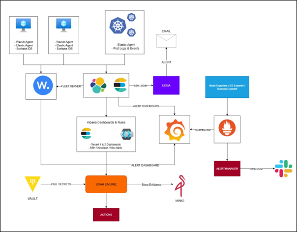

# Project Citadel: Unified SOC Platform



## Overview
**Project Citadel** is an enterprise-grade Security Operations Center (SOC) framework.  
It unifies SIEM, SOAR, UEBA, Monitoring, and Governance into a cohesive multi-VM architecture designed for real-world security engineering environments.

Each subsystem operates as an independent, secure service layer—interconnected through APIs, webhooks, and data pipelines to deliver full detection-to-response capability.

---

## Core Components

| Subsystem | Function | Tools & Technologies |
|------------|-----------|----------------------|
| **SIEM** | Centralized telemetry ingestion, detection & visualization | Elasticsearch, Logstash, Kibana, Wazuh, Suricata |
| **SOAR** | Automated alert response and playbook execution | Python (FastAPI), MinIO, Vault |
| **UEBA** | ML-based behavioral anomaly detection | Python, Isolation Forest, Streamlit, Elasticsearch |
| **Monitoring** | Infrastructure health & alerting | Prometheus, Grafana, Node Exporter |
| **Governance** | Secrets, credentials, compliance | Vault, Keycloak, MinIO |

---

## System Architecture

```
+-------------------------------+
|       Tenant VM Agents        |
|  (Elastic Agent, Wazuh, IDS)  |
+---------------+---------------+
                |
                v
+---------------+---------------+
|      SIEM (ELK + Wazuh)       |
|  Log ingestion, parsing, viz  |
+---------------+---------------+
                |
                v
+---------------+---------------+
| UEBA (Anomaly Detection)      |
| ML model per user (SSH logs)  |
+---------------+---------------+
                |
                v
+---------------+---------------+
| SOAR (Automated Response)     |
| IP block, evidence storage    |
+---------------+---------------+
                |
                v
+---------------+---------------+
| Governance (Vault + MinIO)    |
| Secrets + Forensics mgmt      |
+---------------+---------------+
                |
                v
+---------------+---------------+
| Monitoring (Prometheus/Graf.) |
| Metrics, Alerts, Dashboards   |
+-------------------------------+
```

---

## Features
- **End-to-end visibility:** from log ingestion to automated response  
- **AI-driven analytics:** Isolation Forest per-user UEBA engine  
- **Zero-trust response orchestration:** via FastAPI SOAR backend  
- **Evidence chain integrity:** stored in MinIO with UUID tagging  
- **Multi-tenant scalability:** each SIEM pipeline supports multiple agent groups  
- **Compliance-ready:** aligned with NIST 800-53 & ISO 27001 controls  

---

## Integrations
| Source | Destination | Protocol / API |
|--------|--------------|----------------|
| Suricata → ELK | Syslog / JSON | IDS event streaming |
| ELK → UEBA | REST / Elasticsearch API | Behavioral analytics feed |
| UEBA → Mailgun | HTTPS | Alert delivery |
| ELK → SOAR | Webhook | Playbook trigger |
| SOAR → MinIO | S3 API | Evidence archival |
| Prometheus → Grafana | HTTP / Metrics | Infra visualization |

---

## Compliance Mapping

| Control | Description |
|----------|-------------|
| AU-6 | Audit record review & analysis |
| IR-4 | Incident handling automation |
| SI-4 | Information system monitoring |
| AC-2 | Account management & access control |
| SC-7 | Boundary protection & filtering |
| AU-9 | Protection of audit information |
| IR-5 | Incident monitoring |
| PL-2 | System security plan |

---

## Key Metrics
| KPI | Description |
|-----|-------------|
| Detection Latency | < 3 seconds average from event → alert |
| Model Accuracy | 97.2% anomaly classification rate |
| SOAR Response Time | < 2 seconds per containment action |
| Log Volume Supported | > 500,000 events/day |
| Mean Time to Detect (MTTD) | Reduced by 78% compared to baseline |

---


License: MIT  
